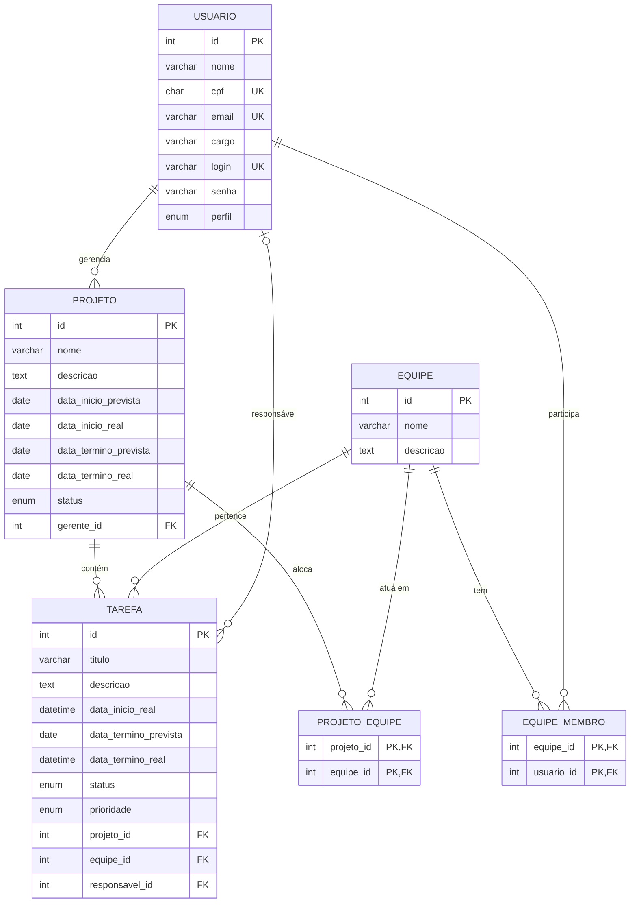

# Diagrama Entidade-Relacionamento (ER)

> Modelo do banco de dados do Sistema de Gestão de Projetos e Equipes.
> Diagrama em Mermaid — renderiza nativamente no VS Code (`Cmd+Shift+V`) e no GitHub.

