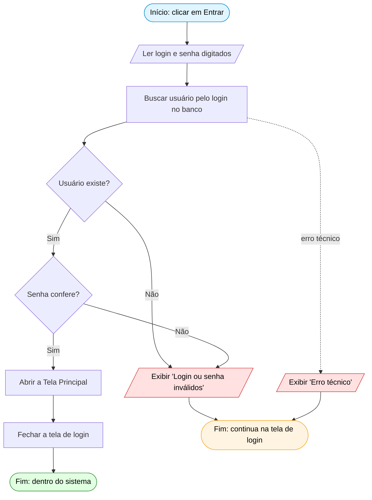

# Fluxograma — Autenticação (Login)

> Representa o algoritmo de **login** do sistema em **três formas**: pseudocódigo, fluxograma e linguagem de programação (Java).
> Atende à Meta de Compreensão: *"Identificar problemas que tenham solução algorítmica e usar raciocínio lógico para formular soluções utilizando diferentes formas de representação: **pseudocódigo, fluxograma e linguagem de programação**."*
> Diagrama em Mermaid — renderiza nativamente no VS Code (`Cmd+Shift+V`) e no GitHub.

---

## Por que o login?

A autenticação é o exemplo mais limpo de **solução algorítmica** do sistema: tem entrada (login e senha), **decisões** (o usuário existe? a senha confere?) e saídas diferentes conforme o resultado. É o tipo de problema que o fluxograma foi feito pra representar.

O fluxo é: a tela de login lê o que foi digitado → o controller procura o usuário no banco e confere a senha → a tela reage (entra no sistema ou mostra erro).

---

## 1ª representação — Pseudocódigo

```
INÍCIO autenticar
    LER login, senha               // do que o usuário digitou na tela

    TENTAR
        usuario ← buscarPorLogin(login)        // consulta no banco de dados

        SE (usuario ≠ nulo) E (senha confere com a do usuario) ENTÃO
            abrir a Tela Principal (com o usuario)
            fechar a tela de login
        SENÃO
            ESCREVER "Login ou senha inválidos"
        FIM SE

    EM CASO DE ERRO TÉCNICO (ex: banco indisponível)
        ESCREVER "Erro técnico: " + mensagem
    FIM TENTAR
FIM
```

> 💡 Repare na condição composta `(usuario ≠ nulo) E (senha confere)`. Os dois testes são ligados por um **E** (`&&`). No fluxograma abaixo, esse "E" vira **dois losangos em sequência** — porque pra a senha valer, primeiro o usuário precisa existir.

---

## 2ª representação — Fluxograma



Legenda das formas (convenção de fluxograma):

| Forma | Significa | Exemplo aqui |
|---|---|---|
| `([ ... ])` arredondado | **Início / Fim** | "clicar em Entrar", "Fim" |
| `[/ ... /]` paralelogramo | **Entrada / Saída** (ler ou exibir) | ler campos, exibir mensagem |
| `[ ... ]` retângulo | **Processo** (uma ação) | buscar usuário, abrir tela |
| `{ ... }` losango | **Decisão** (pergunta sim/não) | "Usuário existe?", "Senha confere?" |
| `-. ... .->` seta tracejada | **caminho de exceção** | erro técnico (banco fora do ar) |

---

## 3ª representação — Linguagem de programação (Java)

O algoritmo já está implementado e dividido em duas camadas (MVC).

**Na View** — `TelaLogin.autenticar()` lê os campos, pede ao controller e reage ao resultado:

```java
private void autenticar() {
    try {
        // 1. Lê o que foi digitado nos campos
        String login = this.loginField.getText();
        String senha = new String(this.senhaField.getPassword());

        // 2. Pede ao controller que autentique
        Usuario usuarioAutenticado = this.controller.autenticar(login, senha);

        // 3. Reage ao resultado
        if (usuarioAutenticado != null) {
            new TelaPrincipal(usuarioAutenticado).setVisible(true); // abre a principal
            dispose();                                              // fecha o login
        } else {
            JOptionPane.showMessageDialog(this, "Login ou senha inválidos.",
                    "Erro de autenticação", JOptionPane.ERROR_MESSAGE);
        }
    } catch (Exception ex) {
        // caminho de exceção do fluxograma (erro técnico)
        JOptionPane.showMessageDialog(this, "Erro técnico: " + ex.getMessage(),
                "Erro", JOptionPane.ERROR_MESSAGE);
    }
}
```

**No Controller** — `UsuarioController.autenticar()` é onde mora a decisão composta:

```java
public Usuario autenticar(String login, String senha) {
    Usuario usuario = usuarioDAO.buscarPorLogin(login);   // "buscar usuário"
    if (usuario != null && usuario.conferirSenha(senha)) { // "existe?" E "senha confere?"
        return usuario;                                    // sucesso
    }
    return null;                                           // falha (vira a mensagem na tela)
}
```

> 💡 **Por segurança**, a mensagem de erro é genérica ("Login ou senha inválidos") — não dizemos *qual* dos dois falhou. No fluxograma isso aparece como **dois caminhos de "Não" levando à mesma saída** (`D -- Não` e `F -- Não` apontam pro mesmo bloco `E`).

---

## Como as 3 representações se correspondem

| Passo do fluxograma | Pseudocódigo | Código (classe · método) |
|---|---|---|
| Ler login e senha | `LER login, senha` | `TelaLogin.autenticar()` (getText / getPassword) |
| Buscar usuário pelo login | `buscarPorLogin(login)` | `UsuarioController.autenticar()` → `UsuarioDAO.buscarPorLogin()` |
| Usuário existe? | `usuario ≠ nulo` | `usuario != null` |
| Senha confere? | `senha confere` | `usuario.conferirSenha(senha)` |
| Abrir Principal + fechar login | `abrir Tela Principal` / `fechar login` | `new TelaPrincipal(...).setVisible(true)` + `dispose()` |
| Exibir "inválidos" | `ESCREVER "..."` | `JOptionPane.showMessageDialog(...)` |
| Erro técnico | `EM CASO DE ERRO` | `catch (Exception ex)` |

> 💡 É exatamente isso que a Meta pede: **o mesmo raciocínio lógico** escrito de três jeitos. O pseudocódigo é a ideia em "português estruturado"; o fluxograma é a ideia em desenho; o Java é a ideia executável. Os três descrevem o **mesmo** algoritmo.

---

## Conexão com a A3

Este artefato cobre a Meta de Compreensão de **representação algorítmica** (pseudocódigo + fluxograma + código) e demonstra também **controle de fluxo** (decisões `if/else`) e **tratamento de exceções** (`try/catch`), que são outras Metas.

Para a apresentação: mostrar as 3 representações lado a lado e dizer *"olha como o mesmo algoritmo de login aparece como ideia (pseudocódigo), como desenho (fluxograma) e como programa (Java) — e os três batem passo a passo"*.

Veja também: [`diagrama-classes.md`](diagrama-classes.md) (estrutura das classes) e [`../docs/dissecando-views.md`](../docs/dissecando-views.md) (dissecação da `TelaLogin`).
